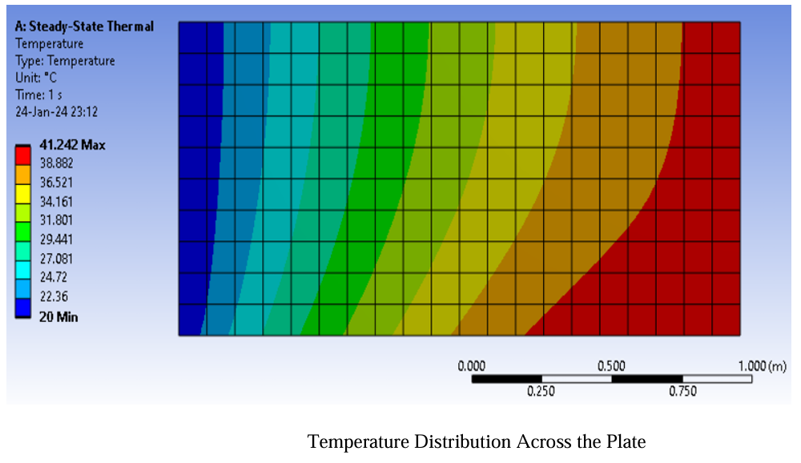

# Finite Difference Analysis for 2D Heat Conduction

## Overview
Collaborated in a team of 3 to develop a numerical approximation for 2D heat conduction using MATLAB. This project leverages the Finite Difference Method to model the thermal distribution in a 2D space, aligning with MATLAB's computational capabilities and verified against ANSYS results.

## Methodology
- **FDM Implementation**: Discretized the heat conduction equation using FDM.
- **Iterative Solver**: Employed Gauss-Seidel method for convergence to steady state.
- **Visualization**: Created MATLAB color contour plots to illustrate the temperature gradient.

## Technologies
- **MATLAB**: For simulation and graphical representation.
- **ANSYS**: For validation of simulation results.

## Results
The simulation outcomes correlate well with the ANSYS verifications, confirming the effectiveness of the FDM in heat conduction modeling.

## Usage
The repository includes detailed setup instructions and commented MATLAB scripts for replicability and understanding.
